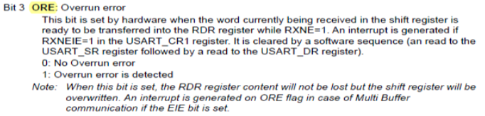

## <center> 交流充电桩MCU软件系统设计

<details>
<summary><font size=5>设计规划</font></summary>
<br>
<font size=4>
1. MCU选型
</font>
   <br>
   <br>
   交流充电桩本身功能相对比较简单，充电结费，和为了实现充电结费所需要的UI交互、计量、读卡器（开启充电/结束充电）、保护控制、故障检测、数据存储和数据交互等功能。UI交互多数交流充电桩是用串口屏，只需要使用MCU的TX、RX两个引脚进行通讯；计量目前多是板载计量芯片，通过I2C总线读取计量芯片的数据，计量误差是交流充电桩的隐性政策风险 ( 因国标未对充电桩的计量制订要求，为了降低成本，目前交流充电桩都没有单桩安装电表做计量，为了降低政策风险需要预留485接口接电表 ) ；保护控制 ( 过压/欠压/过温/接地/过载/短路/漏电等等 ) 通过MCU IO口的外部硬件线路实现，不会涉及到通讯总线；故障检测通过MCU IO口或者通讯总线上读取的错误数据来实现，也不需要额外的通讯总线；数据存储在交流充电桩上大多都是保存在外部 flash，通过SPI总线实现读写；通讯是以太网或LTE模块，以太网可以通过串口或SPI与MCU实现数据交换,  LTE模块通常是串口。
   <br>
   <br>
   充电桩要实现的功能是充电和结费，在地下停车场这种应用场景LTE模块可能会没有信号，只能通过以太网实现数据交互，为了快速和稳定充电结费，在系统中以太网和LTE网络是共存的，只是以太网优先，而且板载以太网芯片成本增加并不多。
   <br>
   <br>
   ram 需求难以预估准确，选大了浪费，选小了不够用,  ota 4k + ethernet uart 4k (2k + 2k) + lte uart 4k (2k + 2k) + flash spi 4k，这就16K了，再放大一倍或两倍，选型要32K以上。需要用到的其它IO口25个左右，64PIN封装估算是可以满足需求。交流充电桩没有复杂运算功能，预留一定的频率调整空间。
   <br>
   <br>
<font size=4>
2. 通讯接口配置
</font>
   <br>
   <br>
   交流充电桩通讯接口需求如下：
   
<!-- 让表格居中显示的风格 -->
<style>
.center 
{
  width: auto;
  display: table;
  margin-left: auto;
  margin-right: auto;
}
</style>

<div class="center">

| 外设                                       | 接口                                   |                    数量                    |  DMA  |
| :----------------------------------------- | :------------------------------------- | :----------------------------------------: | :---: |
| UI&nbsp; &nbsp; &nbsp; &nbsp; &nbsp;       | uart&nbsp; &nbsp; &nbsp; &nbsp; &nbsp; | &nbsp; &nbsp; &nbsp;1 &nbsp; &nbsp; &nbsp; |
| 计量&nbsp; &nbsp; &nbsp; &nbsp; &nbsp;     | i2c <br> rs485                         |                   1<br>1                   |
| 读卡器&nbsp; &nbsp; &nbsp; &nbsp; &nbsp;   | uart                                   |                     1                      |
| flash&nbsp; &nbsp; &nbsp; &nbsp; &nbsp;    | spi                                    |                     1                      |
| ethernet&nbsp; &nbsp; &nbsp; &nbsp; &nbsp; | uart<br>spi                            |                   1<br>1                   |
| lte 模块&nbsp; &nbsp; &nbsp; &nbsp; &nbsp; | uart                                   |                     1                      |
| debug&nbsp; &nbsp; &nbsp; &nbsp; &nbsp;    | uart                                   |                     1                      |

</div>
   <br>
   计量用的 i2c 可以用普通IO口来模拟也可以用硬件i2c，软件系统设计时不用关注。如果尽量使用uart会有6个串口 ( 485要占用一个串口 )，如果以ST MCU为标的，能够选择的只有STM32F2、STM32F4或以上系列芯片可选，MCU的成本会很高。以太网芯片通讯接口如果使用SPI总线，uart就只需要5个，spi需要2个 (也可以共用spi, cs各自配置)，STM32F1系列也能满足需求。为什么要以ST MCU为标的？因为ST的型号系列比较齐全，当遇到硬件资源不够用的情况下可以有其它型号直接替换。开撸就用国产芯片，风险太大。
   <br>

   <!-- ctrl+alt+v -->
   
<br>


<br>
<br>
   在整个系统中，影响系统运行效率的会有三个部分：一个是flash读写，另一个是数据网络传输，再一个是调试打印信息。多个外设DMA同时开启或者同一个DMA多个通道同时开启都没有问题，就算有总线争用发生，也仅是其中一个要稍微等待一下，对于UART这样的低速设备几乎感觉不到DMA访问受阻的存在，而且开启DMA也可以有效改善系统运行效率。也因为打开DMA后系统运行效率更高，遇到数据传输读取的问题就会难以排查，打开DMA放到系统优化时再去实现，以期暴露更多问题，只有打印信息串口打开DMA。

   

   结合硬件需求(方便layout)通讯接口配置如下：

<!-- 让表格居中显示的风格 -->
<style>
.center 
{
  width: auto;
  display: table;
  margin-left: auto;
  margin-right: auto;
}
</style>

<div class="center">

| 外设                                       | 接口                                    |                    DMA                    |
| :----------------------------------------- | :-------------------------------------- | :---------------------------------------: |
| UI&nbsp; &nbsp; &nbsp; &nbsp; &nbsp;       | UART3&nbsp; &nbsp; &nbsp; &nbsp; &nbsp; | &nbsp; &nbsp; &nbsp; &nbsp; &nbsp; &nbsp; |
| 计量&nbsp; &nbsp; &nbsp; &nbsp; &nbsp;     | I2C <br> UART5                          |                                           |
| 读卡器&nbsp; &nbsp; &nbsp; &nbsp; &nbsp;   | UART2                                   |                                           |
| flash&nbsp; &nbsp; &nbsp; &nbsp; &nbsp;    | SPI3                                    |                    OPT                    |
| ethernet&nbsp; &nbsp; &nbsp; &nbsp; &nbsp; | ~~uart~~<br>SPI1                        |                   <br>                    |
| lte 模块&nbsp; &nbsp; &nbsp; &nbsp; &nbsp; | UART1                                   |                    OPT                    |
| debug&nbsp; &nbsp; &nbsp; &nbsp; &nbsp;    | UART4                                   |                    YES                    |

</div>
<br>
<br>
<font size=4>
3. 数据缓存
</font>
   <br>
   <br>
   在系统中要用到多个串口收发数据，UI、RS485、读卡器通讯数据量不大打开DMA也不能完全发挥DMA的作用，只有OTA功能会有较大的数据传输需求，所以设计的数据缓存结构需要能兼容打开DMA的数据传输方式。
   <br>
   <br>
   1M波特率1S传输100K字节 (1 start + 8 bit + 1 stop)，如果使用中断发送，每10us产生一次中断会消耗大量中断资源；如果使用循环发送，需要消耗CPU资源传输数据，传输数据量大时任务调度也会阻塞，这也是调试信息串口为什么要打开DMA的原因。<br>
   <br>

   
   <br>
   单缓存的数据结构例如数组数据接收需要DMA中断协助。当DMA传输数据完成，CPU开始接收DMA通道的数据写入buffer，如果此时DMA通道继续有数据进来，会不会将DMA通道的原有数据覆盖？因为DMA传输数据不需要CPU任何干预 (不受CPU控制)，看起来单缓存的数据结构存在风险。
   <br>

   
   <br>
   双缓存，DMA触发传输过半标志位 (HTIF) CPU将数据保存到buffer1，触发传输完成标志位 (TCIF) CPU将数据保存到buffer2，交替使用。看起来是可以避免单缓存的风险，但是需要DMA中断协助切换缓冲区，而且最终还需要拼包。
   <br>

   
   <br>
   从MCU的系统架构来看，这个冲突是出现在Bus matrix 到 SRAM 的数据传输过程中。
   <br>
   <br>
   
   <br>
   <br>
   
   <br>
   MCU本身是有这种冲突的保护机制，只需要监控ORE bit就知道是不是出现了溢出错误。
   <br>
   
   <br>
   环形缓存在串口传输数据时仅需要串口收发中断写入缓存区，打开DMA也不需要DMA中断参与，只要读取速度足够快就可以避免buffer被填满，也就是说应用程序只需要关注应用端本身，将需要传输的数据写入环形缓冲，数据的收发交给串口中断去处理，不需要其它任务参与数据处理，因此环形缓冲 (ring buffer)数据结构是比较理想的选择。
   <br>
   <br>
   &nbsp; &nbsp; &nbsp; &nbsp; &nbsp; &nbsp;ring buffer介绍可以参考链接：https://www.embedded.com/ring-buffer-basics/
   <br>
   <br>
   &nbsp; &nbsp; &nbsp; &nbsp; &nbsp; &nbsp;ring buffer代码可以参考链接：https://github.com/AndersKaloer/Ring-Buffer
   <br>
   &nbsp; &nbsp; &nbsp; &nbsp; &nbsp; &nbsp;注意参考代码中定义的缓冲区长度是2的幂，如果想将缓冲区长度任意定义，链接代码需要做些改动。
   <br>
   <br>
<font size=4>
4. LOG输出
</font>
   <br>
   <br>
   因为要支持OTA，在线调试就不能用了，调试手段只能是输出打印信息；另一方面，充电桩安装地址可能在全国各地，如果现场设备出现故障只能是远程调试。打印信息就是一种比较好的发现问题、排除故障的调试手段。为了减少输出打印信息对系统的影响，将输出打印信息的串口打开DMA，TX用作调试信息输出，RX用作调试指令接收端口 (例如通过PC向设备端发送调试指令)，并将串口以较高的波特率运行。
   <br>
   <br>
   为了输出可变长度的调试信息，需要解决如何计算可变长度变量的长度大小才能通过串口发送，引入vsnprintf来取得这个长度。

```C
uint8_t logTxBuff[LOG_TX_SIZE] = {0};
void LogPrintf(char *format, ...)
{
    va_list args;
    uint16_t size = 0;

    va_start(args, format);
    size = vsnprintf((char *)logTxBuff, sizeof(logTxBuff)/sizeof(logTxBuff[0]) - 1, format, args);
    va_end(args);
    HAL_UART_Transmit_DMA(&huart4, logTxBuff, size);
    while(huart4.TxXferCount){
        //wait DMA xfer complete
    }
    memset(logTxBuff, 0, sizeof(logTxBuff));
    
    huart4.gState = HAL_UART_STATE_READY;
}
```
<br>
Notes:&nbsp;&nbsp;如果要防止数据溢出上述代码需要再作修改。
<br>
<br>
   用IO口置高表示开始输出打印信息，置低表示结束输出打印信息
   <br>

   
   <br>
   上图是串口波特率为115200时输出77个字符打印信息两个串口耗费时间的对比，黄色是没有打开DMA输出打印信息耗费时间7.846ms，蓝色是打开DMA输出打印信息耗费时间6.697ms。
   <br>
   <br>
   
   <br>
   上图是串口波特率黄色为115200蓝色为1000000时输出77个字符打印信息两个串口耗费时间的对比，黄色是没有打开DMA输出打印信息耗费时间7.706ms，蓝色是打开DMA输出打印信息耗费时间931us。
<br>
<br>
<font size=4>
5. LOG保存
</font>
   <br>
   <br>
   为了实现远程调试，一方面需要将设备的日志信息保存在本地 (设备的外部flash)，另一方面还需要能通过远程实现日志上传和日志的分级控制。比如某台充电桩出现故障，通过上传设备本地的日志信息但是分析不出具体原因，设备本地的日志信息由于受限于flash的物理限制通常只能是一些程序中的关键数据，无法将设备的所有调试信息都保存在本地，这时就需要远程修改日志等级让设备端将更多的日志信息写入本地存储设备然后上传给后台。
   <br>
   <br>
   分级控制容易实现，将日志信息通过spintf或snprintf写入临时缓存，如果当前的日志等级需要将此信息保存在本地，则将临时缓存中的数据写入日志缓存，当日志缓存写满则将数据写入flash (日志缓存大小为4k，与flash的扇区大小一致)。选用的外部flash容量大小为64M-BIT，划出一半的容量4M用作log保存 (这个容量大小根据实际需要再调整，只要保证在设备的寿命周期内flash的擦除次数不要超过flash本身的擦除次数的物理极限)。
   <br>
   <br>
   为了解决大容量数据存取需要引入FatFS，本地保存的log就可以以文件的方式传送给后台 (在FatFS管理下本地LOG也可以分成多个文件保存)。通常充电桩都是常供电FatFS易损坏的特性在充电桩产品上可以忽略。因为并不打算以较高的频率运行系统，引入FatFS后的文件操作可能要占用比较长的时间，这个后续根据实际情况再调整系统工作频率。
   <br>
   <br>

   为了实现最极致的成本，加上充电桩的任务并不复杂，不打算引入RTOS，数据收发使用环形缓冲，任务调度使用轮询，选用STM32F103直接裸奔开撸。
<br>
</details>
<br>
<details>
<summary><font size=5>Q&A</font></summary>
<br>
<font size=4>
1. 串口波特率误差
</font>
   <br>
   <br>
   如果晶振发生了漂移，对通信会有影响。国标充电桩的工作温度-20 -- +50 ，如果晶振频率误差引起波特率误差超过2%，就要考虑换晶振。对于期望误差率为0的强迫症来说，波特率计算出来的误差为0可以用不同的方式达成：选用合适频率的外部晶或者配置合适的系统时钟。当系统时钟为32MHz或36MHz或72MHz，1MHz波特率误差均为0%，用于串口输出调试信息。

   
   <br>
   <br>
<font size=4>
2. 轮询带来的问题
</font>
<br>
<br>
   对于交流充电桩来说实时性要求并不高，轮询调度对一般性事务(非网络数据传输任务)足以满足应用需求。但是对于网络数据传输来说轮询甚或抢占式调度都会面临一个问题：因为网络时延的不确定性，以什么样的时间间隔去轮询或者以什么条件去触发抢占调度？后台socket通道断开连接的超时时间是15秒，即后台发送一帧数据到收到客户端的回复需要在15秒内，反过来说客户端在15秒内收到后台的回复数据都是可能的(在实际调试中遇到过客户端超过12秒才收到后台的数据)，如果以15秒的时间间隔去轮询任务这个时间太长系统效率很低。
   <br>
   <br>
   
   <br>
   环形缓存轮询任务流程如上图所示，当环形缓冲为空时结束数据处理等待下一次任务调度；当环形缓冲不为空执行数据处理并dequeue (环形缓存清空)。当执行环形缓存轮询任务时，环形缓存不为空但是数据尚未完全接收完成时，这时的数据处理就会出错。这个问题在网络数据传输过程中必然会出现，只是出现概率大小而已。
   <br>
   <br>
   怎样重现这个问题又如何来解决这个问题？
   <br>
   <br>
   遇到这个问题是在OTA时发现的，在正常的使用过程中偶尔也会遇到丢包的现象，但是很难复现，但在OTA过程中就会频繁出现，原因是OTA数据包的长度是1024字节，传输耗费的时间较长，正常使用中数据包多数就几十字节。串口波特率115200，1024字节数据传输输需要时间：
   <br>
   &nbsp;&nbsp;&nbsp;&nbsp;&nbsp;&nbsp;&nbsp;&nbsp;1000 / (115200 / 10) * 1024 = 88.89 ms
   <br>
   <br>
   
   <br>
   实际捕获波形波特率115200串口传输1024字节耗时 96.8 ms左右。
   <br>
   <br>
   
   <br>
   图中绿色脉冲的上升和下降沿表示开始轮询环形缓冲，粉色是串口传输的数据。程序运行判断环形缓冲不为空，环形缓冲中的数据dequeue并执行数据解析，因为数据不完整无法完整解析被丢弃。这种情况即使在dequeue时添加串口中断标志位的判断作延时处理，也没有什么改善。
   <br>
   <br>
   在代码中环形缓冲dequeue后的数据解析中因为数据不完整而被丢弃后添加打印信息：prefetch_disintegrity
   <br>
   <br>
   
   <br>
   通过在程序中添加打印信息也是可以发现问题。
   <br>
   <br>
   使用双缓冲可能也是一种解决办法，但是双缓冲需要多占用一份RAM空间，与我们想要的极致的成本设计思路不一致，需要寻找其它办法。前面提到的环形缓冲参考代码中的 ring_buffer_peek() 给了我们灵感，如果我们能判断环形缓冲中的数据是完整的再执行dequeue，如果数据不完整则不执行等待下一次轮询，就可以避免因为dequeue操作而丢弃数据的问题。
   <br>
   <br>
   
   <br>
   传输的数据均是来自于我们自己的应用，所以我们会清楚知道每一帧数据的格式，从数据格式中将每一帧的数据长度提取出来作为我们判断数据完整性的依据，但是不执行任dequeue动作，我称之为 ring_buffer_prefetch()。
   <br>
   <br>
   
   <br>
   既然象上图都可以申请专利，环形缓冲预读取机制结合网络传输数据整个专利应该也是可行的，在需要网络传输数据的IoT设备上这种机制具有一定的普适性。
   <br>
   <br>
<font size=4>
3. 物联网卡白名单
</font>
<br>
<br>
   移动、电信定向卡都有白名单功能，需要把连接的网址加入白名单并激活卡后才能正常使用，但是不是每一个卡商都会正确添加白名单，有的卡商只会卖卡！只会卖卡！只会卖卡！用手机卡来调试吧，这种卡商要拉出来打八十大板。

</details>

<br>
<details>
<summary><font size=5>探讨</font></summary>
<br>
<br>
<font size=5>
1. 静态功耗
</font>
<br>
<br>
   充电桩在未充电状态下的功耗似乎没人关注，在接触的桩企中从没有讨论过功耗的问题，似乎被大家遗忘了。目前充电桩充电收费方式是电费+服务费，对于充电桩运营商来说利润来源一部分是电费差价，另一部分是充电而产生的服务费用，运营成本有一部分是来自于充电桩本身的损耗。
   <br>
   目前的交流充电桩未充电状态大多是宣称功耗12W左右，如果以RMB1.00/度电费和1000台交流充电桩来测算:
   <br>
   &nbsp;&nbsp;&nbsp;&nbsp;&nbsp;&nbsp;&nbsp;&nbsp;一个月的损耗费用:&nbsp;&nbsp;&nbsp;&nbsp;&nbsp;&nbsp;&nbsp;&nbsp;&nbsp;&nbsp;&nbsp;&nbsp;&nbsp;&nbsp;(12 * 24)/1000 * 1 * 1000 * 30 &nbsp;&nbsp;&nbsp;&nbsp;&nbsp;&nbsp;&nbsp;&nbsp;&nbsp;&nbsp;&nbsp;&nbsp;= 8640 元/月/千台
   <br>
   如果充电桩功耗 (充电桩主板的功耗) 降低30%，仍然以RMB1.00/度电费和1000台交流充电桩来测算：
   <br>
   &nbsp;&nbsp;&nbsp;&nbsp;&nbsp;&nbsp;&nbsp;&nbsp;一个月节约的损耗费用:&nbsp;&nbsp;&nbsp;&nbsp;&nbsp;(12 * 24)/1000 * 1 * 1000 * 30 * 30% = 2592 元/月/千台
   <br>
   <br>
   当运营的充电桩数量足够多的时候每天节省下来的损耗就是实实在在的落入口袋的人民币。
   <br>
   <br>
<font size=5>
2. 数据加密
</font>
<br>
<br>
交流充电桩与后台的数据交互多数都是以明文的方式传输，尤其是串口通讯使用较多，更需要注意保护数据防止数据被篡改。当运营的充电桩数量足够多时，再想去更改，工作量和成本就是一件很恐怖的事情。
<br>
<br>
<font size=5>
3. 国产MCU
</font>
<br>
<br>
   在交流充电桩产品上的MCU常见的是ST，或者是能PIN to PIN直接替代ST的GD、Artery之类，国内这么多的MCU厂商在这个产品上没有展现更多的身影。对于交流充电桩主板供应商来说MCU集成以太网是具有一定的成本优势，常见的MCU具有以太网功能的多数仅集成PHY，还是需要外加MAC芯片。集成以太网芯片功能的MCU市场上还是有的，比如CH32F207VCT6，买MCU送以太网芯片，一句话的事竞然没看到沁恒在一些大的论坛上做相关推广？国产MCU加油把ST芯片的价格打下来！
   <br>   

   
   <br>
   <br>
<font size=5>
4. 测试
</font>
<br>
<br>
   交流充电桩的测试除了作为硬件设备的功能测试外，网络性能测试也是需要考虑的。一方面通过网络压力测试用来验证服务器在高压下的响应和性能，另一方面用来验证设备连接后台的可靠性。尤其要注意通讯中出现的RST报文，有些异常断开连接可能就是RST引起的，需要对引起RST的原因仔细鉴别。
   <br>
   <br>
</details>

<br>
<br>